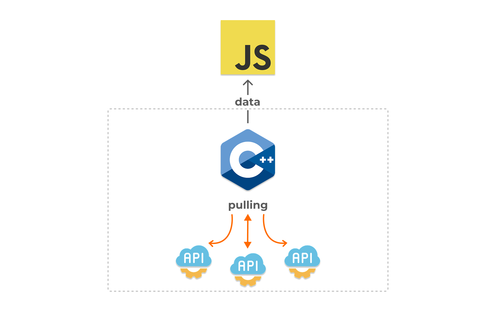

# 🚀 SyncTasksManager (JSI)

<p align="center">

</p>

**SyncTasksManager** is a native JSI-based library for React Native that allows you to manage and execute background sync tasks (such as periodic API polling) efficiently from JavaScript, while delegating the actual execution to the native layer for better performance.

---

## ⚙️ Features

- 🔁 Periodic HTTP polling with configurable interval
- 📡 Callback on data reception or error
- 🧵 High-performance task execution via JSI
- 🧠 Centralized task management (start/stop all tasks)
- ✅ Seamless integration with native modules (C++/JSI)
- ✨ Built-in response deduplication using response body hash — avoids redundant `onData` calls if the response has not changed

---

## 📦 Installation
```bash
npm install react-native-sync-tasks
```

> Don’t forget to run `pod install` for iOS if using CocoaPods.

---

## 🛠️ Usage

```ts
import { createTask, SyncTasksManager } from 'react-native-sync-tasks';

type TData = {
  userId: number;
  id: number;
  title: string;
  body: string;
};

const task = createTask<TData>({
  config: {
    url: 'https://jsonplaceholder.typicode.com/posts/1',
    // 2000ms / default 1000ms
    interval: 2000, 
    // headers optional
    headers: {
      'Content-Type': 'application/json',
      'Accept': 'application/json',
    },
  },
  // { body: TData, status_code: number }
  onData: (data) => {
    console.log('DATA', data);
  },
   // { error: string, status_code: number }
  onError: (error) => {
    console.log('ERROR', error);
  },
});

SyncTasksManager.addTask(task);
SyncTasksManager.startAll();
...
// stop all tasks
SyncTasksManager.stopAll();
// or stop only 1 task
task.stop()

```

---

## 🔍 API

### `createTask<T>(props: CreateTaskParams<T>): Task`

Creates a background task that will periodically fetch data from the specified URL.

#### Params:

| Name      | Type                                                                 | Description                                   |
|-----------|----------------------------------------------------------------------|-----------------------------------------------|
| `config`  | `{ url: string; interval: number; headers?: Record<string, string> }` | HTTP polling configuration                    |
| `onData`  | `(data: { body: T, status_code: number }) => void`                                                  | Callback when data is successfully received   |
| `onError` | `(error: { error: string; status_code: number }) => void`     | Callback when request fails (optional)        |

> Under the hood, the task stores a hash of the last response body. If the newly fetched response is identical (hash matches), the `onData` callback will **not** be triggered.

### `Task`

Represents an individual background sync task.

#### Methods:

- `start(): void` — Manually start the task
- `stop(): void` — Stop the task
- `isRunning(): boolean` — Check if the task is currently running

---

### `SyncTasksManager`

A global task manager for controlling multiple tasks at once.

#### Methods:

- `addTask(task: Task): void` — Add a single task
- `addTasks(tasks: Task[]): void` — Add multiple tasks
- `startAll(): void` — Start all registered tasks
- `stopAll(): void` — Stop all running tasks

---

## 📄 License

MIT

---

