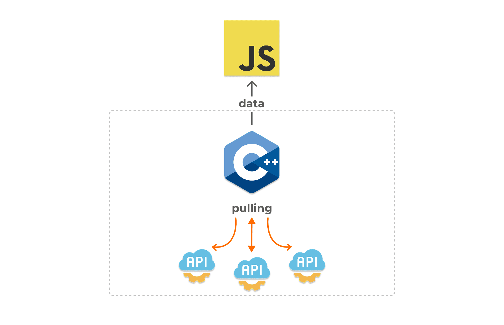

# 🚀 SyncTasksManager (JSI)

<p align="center">

</p>

**SyncTasksManager** is a native JSI-based library for React Native that allows you to manage and execute **native-threaded sync tasks** (such as periodic API polling) efficiently from JavaScript, while delegating the actual execution to the native layer for better performance.

> ⚠️ **Note**: This is not a background task manager — tasks do not continue running when the app is in the background or killed. The polling happens while the app is active, on a native thread, outside the JS thread.

---

## ⚙️ Features

- 🔁 Periodic HTTP polling with configurable interval
- 📡 Callback on data reception or error
- 🧵 High-performance execution via native thread using JSI
- 🧠 Centralized task management (start/stop all tasks)
- ✅ Seamless integration with native modules (C++/JSI)
- ✨ Built-in response deduplication using response body hash — avoids redundant `onData` calls if the response has not changed

---

## 📦 Installation
```bash
npm install react-native-sync-tasks
```

> Don’t forget to run `pod install` for iOS if using CocoaPods.

---

## 🛠️ Usage

```ts
import { createTask, SyncTasksManager } from 'react-native-sync-tasks';

type TData = {
  userId: number;
  id: number;
  title: string;
  body: string;
};

const task = createTask<TData>({
  config: {
    url: 'https://jsonplaceholder.typicode.com/posts/1',
    // 2000ms / default 1000ms
    interval: 2000,
    // headers optional
    headers: {
      'Content-Type': 'application/json',
      'Accept': 'application/json',
    },
  },
  // { body: TData, status_code: number }
  onData: (data) => {
    console.log('DATA', data);
  },
  // { error: string, status_code: number }
  onError: (error) => {
    console.log('ERROR', error);
  },
});

SyncTasksManager.addTask(task);
SyncTasksManager.startAll();
...
// stop all tasks
SyncTasksManager.stopAll();
// or stop only 1 task
task.stop();
```

---

## 🔍 API

### `createTask<T>(props: CreateTaskParams<T>): Task`

Creates a task that will periodically fetch data from the specified URL, executed on a native thread.

#### Params:

| Name      | Type                                                                 | Description                                   |
|-----------|----------------------------------------------------------------------|-----------------------------------------------|
| `config`  | `{ url: string; interval: number; headers?: Record<string, string> }` | HTTP polling configuration                    |
| `onData`  | `(data: { body: T, status_code: number }) => void`                   | Callback when data is successfully received   |
| `onError` | `(error: { error: string, status_code: number }) => void`            | Callback when request fails (optional)        |

> Under the hood, the task stores a hash of the last response body. If the newly fetched response is identical (hash matches), the `onData` callback will **not** be triggered.

### `Task`

Represents an individual polling task running on a native thread.

#### Methods:

- `start(): void` — Manually start the task
- `stop(): void` — Stop the task
- `isRunning(): boolean` — Check if the task is currently running

---

### `SyncTasksManager`

A global manager to control multiple polling tasks.

#### Methods:

- `addTask(task: Task): void` — Add a single task
- `addTasks(tasks: Task[]): void` — Add multiple tasks
- `startAll(): void` — Start all registered tasks
- `stopAll(): void` — Stop all running tasks

---

## 📄 License

MIT

---

🎉 **Enjoy using react-native-sync-tasks!** Offload polling to native threads and keep your JS thread free.

